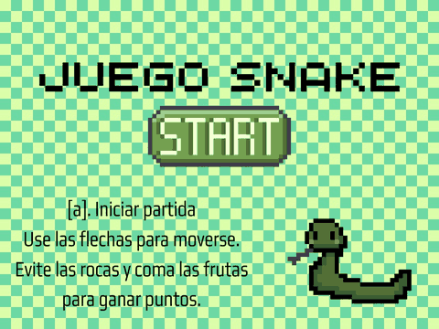

# Snake en Pygame

El clásico juego de la viborita, con obstáculos y dificultad progresiva, hecho en Python con Pygame. Es el trabajo práctico de **Laboratorio de Computación II** (Tecnicatura en Programación Informática, UNSAM, 2023), hecho en equipo.

## Problema que resuelve

La consigna pedía hacer un juego con Pygame para consolidar lo aprendido en Python. Parece simple hasta que lo armás: hay que resolver un loop de juego en tiempo real, leer el teclado, detectar colisiones y pasar de una pantalla a otra (menú, partida y game over).

## Demo



Se juega con las flechas. Cada manzana suma un punto y acelera un poco el juego. Perdés si chocás contra una roca, contra el borde o contra tu propio cuerpo.

## Tecnologías

- **Python 3**
- **Pygame**: ventana, eventos de teclado, sprites y control de FPS.

## Cómo funciona

El campo es una grilla de bloques de 20×20 px sobre una ventana de 800×600.

- **El snake es una lista de posiciones con la cabeza al final.** En cada frame agrego la nueva cabeza y saco el primer elemento (la cola). Si en ese frame come una fruta, no saco la cola, y así crece sin lógica extra.
- **No puede girar 180°.** Guardo la última dirección pedida y solo la aplico si no es la opuesta a la actual. Sin este chequeo, apretar dos flechas rápido en el mismo frame hacía que el snake se diera vuelta sobre sí mismo y perdiera.
- **La dificultad sube con la velocidad del reloj.** `clock.tick(velocidad)` limita cuántos movimientos hay por segundo, y cada fruta multiplica la velocidad por 1,05. No hacen falta temporizadores aparte.
- **Si una posición al azar cae en un lugar ocupado, se sortea de nuevo.** Frutas y rocas se ubican al azar hasta caer en un casillero libre. Como el campo está casi vacío, es simple y alcanza.
- **Obstáculos:** hay rocas fijas en posiciones elegidas a mano y 4 rocas aleatorias nuevas en cada partida.
- **Game over semitransparente:** dibujo una capa negra con transparencia sobre el último frame, así se ve dónde perdiste.
- **El primer frame queda congelado** hasta que tocás una tecla, para que la partida no arranque de golpe.

El código está dividido por responsabilidad:

| Archivo | Qué hace |
|---|---|
| `snake.py` | Punto de entrada: loop principal, lectura del teclado y flujo menú → partida → game over |
| `logica.py` | Reglas del juego, sin Pygame: movimiento, dirección, colisiones y posiciones aleatorias |
| `pantallas.py` | Todo lo que se dibuja: carga de imágenes, campo, puntaje, menú y game over |
| `config.py` | Tamaños, velocidades, colores y posiciones iniciales |
| `assets/` | Sprites y fondos |

## Cómo correrlo

Requiere Python 3.8 o superior.

```bash
git clone https://github.com/solalcaraz/snake-pygame.git
cd snake-pygame
pip install -r requirements.txt
python snake.py
```

**Controles:**

- **Menú:** `A` para jugar, `B` para salir.
- **Partida:** flechas para moverte.
- **Game over:** `R` para volver a jugar, `Q` para salir.

## Qué aprendí y qué mejoraría

**Qué aprendí**

- Cómo se arma un loop de juego (leer eventos, actualizar el estado, dibujar y esperar al próximo frame) y por qué conviene ese orden.
- Que representar bien el estado simplifica todo: con el snake como lista de posiciones, crecer y detectar choques con el propio cuerpo sale casi gratis.
- A trabajar en equipo sobre el mismo código con Git y GitHub.
- Lo que cuesta leer código propio sin separación de responsabilidades ni nombres claros. Me di cuenta al retomarlo.

**Qué mejoraría**

- Guardar el puntaje máximo entre partidas.
- Agregar pausa y sonido.
- Escribir tests para `logica.py`, que ya no depende de Pygame y es fácil de probar.

## Autoría y mejoras

Este repositorio es el original del trabajo práctico que hicimos en equipo en noviembre de 2023. El tag [`v1.0-tp-original`](https://github.com/solalcaraz/snake-pygame/tree/v1.0-tp-original) marca el TP tal como lo entregamos.

**Equipo:** Damián Palomba, Franco Medina y Sol Alcaraz.

**Mi parte en la versión original**:

- La primera versión del juego: la víbora, el movimiento y el fondo.
- Los sprites de la cabeza en cada dirección, la manzana y el cuerpo.
- La imagen del menú.

**Lo que hice después**:

- Separé en módulos con responsabilidades claras el código, que era un solo archivo, y moví las imágenes a `assets/`.
- Saqué el código muerto (imports y constantes sin uso, un `print` de debug y una línea que nunca se ejecutaba) y unifiqué la lógica repetida: salir del juego, esperar una tecla y los `if` por cada dirección.
- Corregí tres bugs:
  - Cerrar la ventana en medio de la partida tiraba un error.
  - Los menús usaban el 100% de un núcleo del procesador mientras esperaban una tecla.
  - Las fuentes se creaban de nuevo en cada frame.
- Hice que las imágenes se carguen con rutas relativas al script, así el juego corre desde cualquier carpeta.
- Agregué `requirements.txt`, grabé la demo y escribí este README.